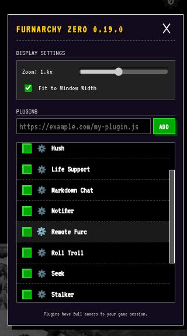
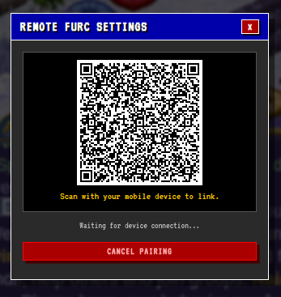
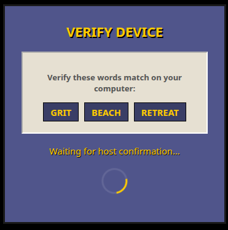
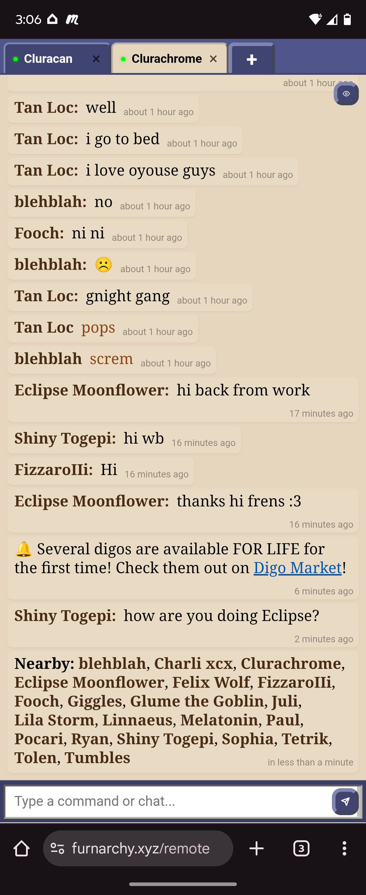

# Remote Furc User Guide

Remote Furc allows you to securely access your Furcadia chat and send commands from any mobile device or secondary computer. Whether you're away from your desk or just want to use your phone as a second screen, Remote Furc keeps you connected.

## Features

- **Real-time Chat:** Send/Receive whispers, channel messages, and local chat instantly on your mobile device.
- **Persistent Sessions:** Because the plugin sits between the Furacadia servers and your device, your sessions are persistent and can gracefully resume on your mobile device.
- **Multi-Character Support:** Simple tabbed view to quickly cycle between active character chats.
- **Secure Messaging:** All communication is encrypted end-to-end. No one (not even the relay server[[1]](#architecture)) can read your messages.

## Getting Started

### 1. Enable the Plugin
First, ensure that the **Remote Furc** plugin is enabled in your Furnarchy settings.

### 2. Open Remote Furc Settings
Click on the **Remote Furc** settings/gear icon (find it in the Plugin Manager). You must be logged into a character to configure settings.

### 3. Pair a New Device
In the Remote Furc Settings modal, click the **+ Pair New Device** button. A QR code will appear on your screen. Pairing must be done ONCE for each device and character combination you want to pilot remotely.

### 4. Connect on Mobile
1. Open the camera on your phone and scan the QR code.
2. Your mobile browser will open the Remote Furc interface.

*Note: If you want to instead use the same computer in lieu of a remote "device", you can just click the QR code to open it in a new tab and proceed as usual.*

### 5. Verify the Connection (Security Check)
The Remote Furc plugin and your device will then establish a secure communications channel. A set of **3 verification words** will appear on both your computer and your mobile device.

1. Compare the words on both screens.
2. If they match exactly, click **"They Match"** on your *computer* (not mobile device).
3. Enter a name for your device (e.g., "My iPhone") and click **Finish Pairing**.

## How to Use

Once paired, you can visit the Remote Furc URL ([https://furnarchy.xyz/remote](https://furnarchy.xyz/remote)) on your paired mobile device whenever you are logged in on your computer.

### The Interface
- **Chat Feed:** Displays your incoming messages.
- **Input Bar:** Type here to speak. Use `:` for emotes (e.g., `:waves`). Use `/NAME MSG` to whisper players. Use `` ` `` (backtick) for raw commands (e.g., `` `summon NAME ``).
- **Nearby List:** The eye button lists who is currently standing within earshot of your character.
- **Clickable Names:** Click on player names in chat to look at or whisper them.
- **Session Tabs:** Each active session/character has a tab at the top you can click on to instantly switch to it. Tab names glow when a new message comes in. Press the `+` tab to activate another paired session.
- **Shortcuts**: `Ctrl + [` or `Ctrl + ]` (if you have a keyboard) to cycle through active sessions/characters.

---

## Technical Details

Remote Furc is designed with security and privacy as a priority. Here is a breakdown of how it works under the hood.

### Architecture
Remote Furc uses a "Host-Relay-Client" architecture:
- **Host (computer):** Your Furnarchy (web) client acts as the host.
- **Relay:** A middleman server that passes encrypted packets between the Host and the Remote.
- **Remote (Mobile):** The web interface running on your phone.

### Cryptography
Every pairing generates a unique, persistent shared secret between your computer and your mobile device using **Elliptic Curve Diffie-Hellman (ECDH)**.

- **End-to-End Encryption (E2EE):** All messages are encrypted using **AES-GCM (256-bit)**. The relay server never sees the plaintext messages because it doesn't have your shared secret.
- **Verification (SAS):** The 3-word verification code is a "Short Authentication String" derived from the shared secret and the public keys of both devices. This protects you against "Man-in-the-Middle" attacks.

### Privacy
- **No Message Logs:** The relay server is "stateless" regarding your messages. It doesn't save any chat history because it can't even see them.
- **Local Storage:** Your paired device information is stored locally in your Furnarchy profile on your browser.
- **Unique Character-Device Encryption:** Each character and device pairing has its own encryption keys.

